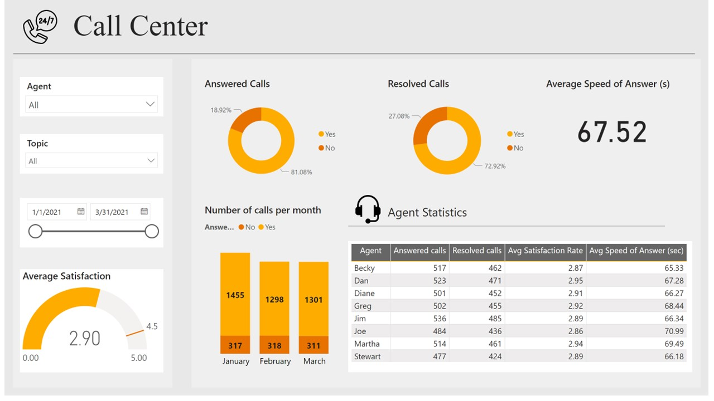
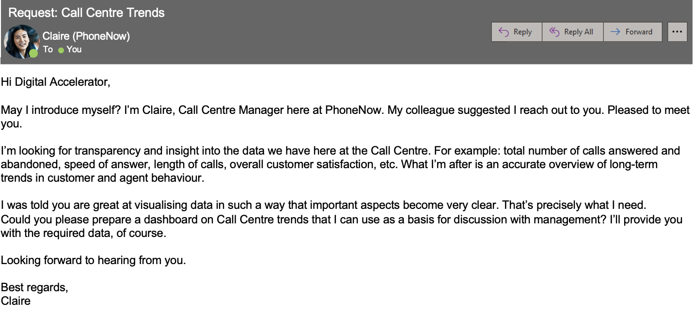
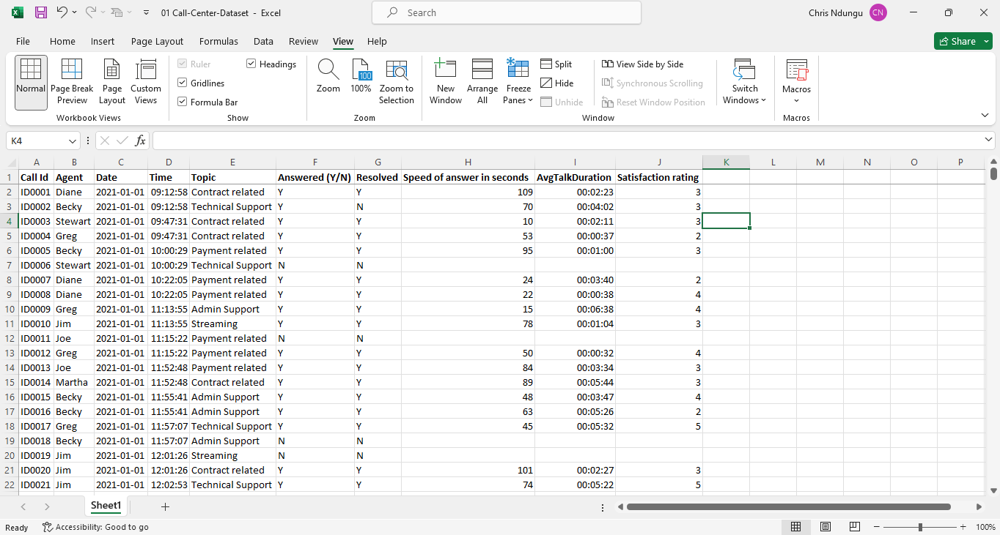
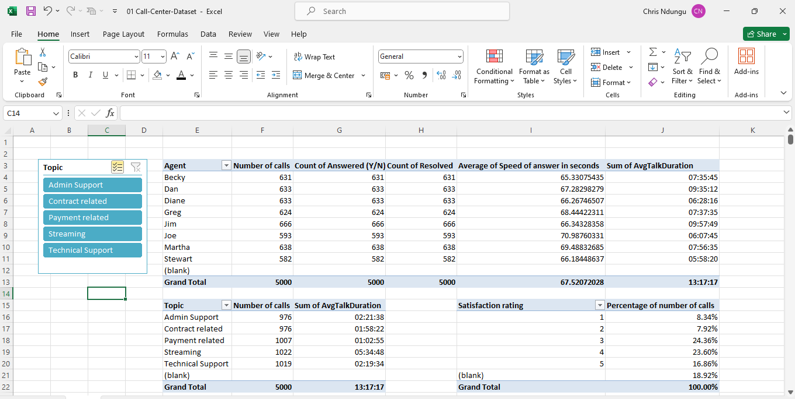
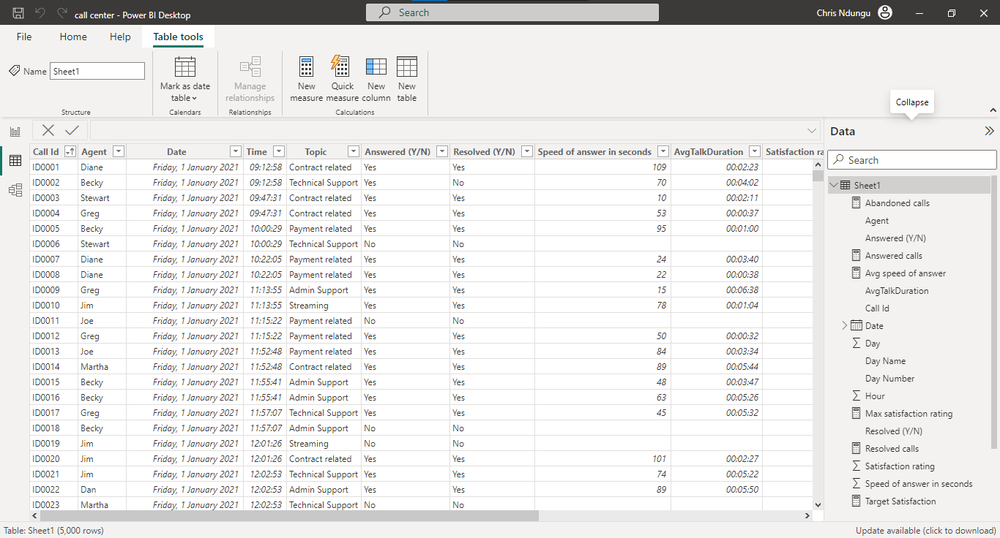
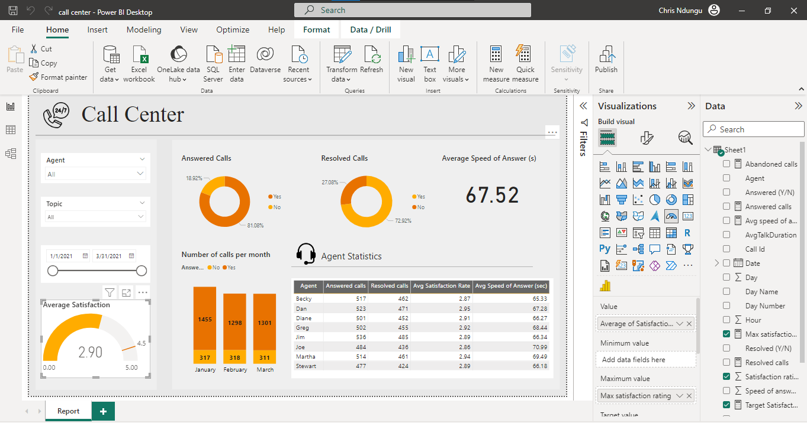

<h1 align='center'>Call Center Dashboard </h1> 

 **NB: This is a virtual internship project offered by PWC through [Forage](theforage.com).**

**This dashboard was created to visualize relevant KPIs and metrics for a call center company.**

## Problem
The image below is a screenshot of an email sent by the client explaining the problem and and what needs to be done. 

The center manager wants a dashboard prepared, to use as a basis of discussion with the management team. 

## Possible KPIs
* Overall customer satisfaction
* Overall calls answered/abandoned
* Calls by time
* Average speed of answer
* Agent’s performance quadrant -> average handle time (talk duration) vs calls answered

To create the database, the following **process** was followed: 
### 1. Getting the data
The required data was provided by the center manager.  
The data was in tabular form in an excel workbook.

### 2. Analysing the data
The xlsx file was uploaded into excel for data analysis and cleaning. 

The image above shows a preview of the data in excel. 

Data formats were checked and the correct data formats were assigned to Date, Time and AvgTalkDuration columns.  

A pivot table was then created to show the performance of all the agents, the satisfaction rate and the distribution of calls per topic. 

### 3. Creating metrics in Power BI
The cleaned dataset was imported into Power BI to create the dashboard.  
Different metrics were created including;  
* Average speed of answer
* Max satistaction rating
* Target satisfaction rating

### 4. Creating the dashboard
Using these metrics and other relevant columns, a dashboard for the relevant KPIs was created using Power BI.

<h2 align=center>Thank You !!</h2>

## Contact
LinkedIn: [Chris Ndungu](https://www.linkedin.com/in/chris-ndungu/)  
Email: chrisndungu.tech@gmail.com
## 
